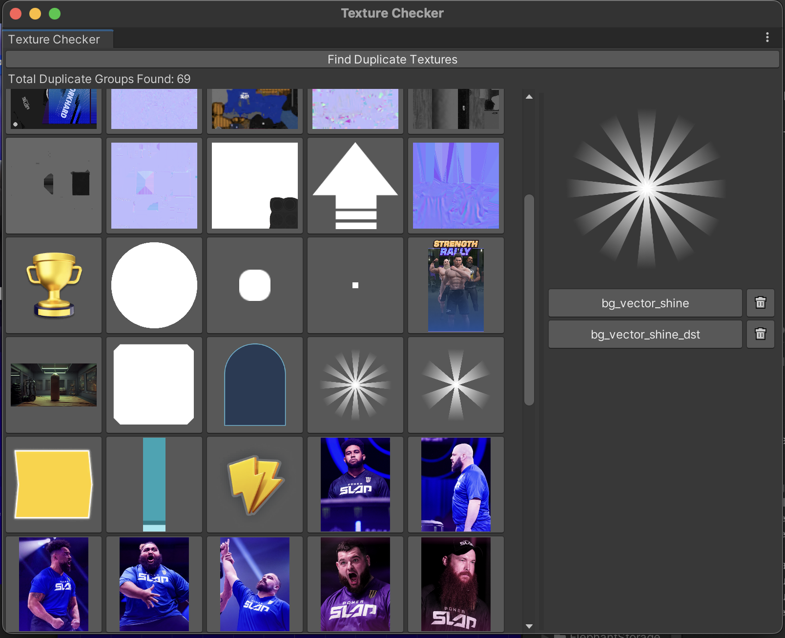

# Texture Checker

A Unity Editor tool designed to identify and manage duplicate textures in Unity projects. This tool scans through all `Texture2D` assets, detects duplicates based on their pixel data, and provides a user-friendly interface to view, select, and delete duplicate textures.


## Features

- **Duplicate Detection**: Scans all `Texture2D` assets in the project and identifies duplicate textures using a hashing mechanism.
- **User Interface**: Displays duplicate textures in a grid format, with options to inspect individual groups of duplicates.
- **Texture Deletion**: Allows direct deletion of unwanted duplicate textures from the project, helping to save storage space and maintain project organization.
- **Active Texture Preview**: Click on any texture to view its duplicates in detail and select specific instances for further actions.

## Installation

1. Copy the `DuplicateTextureDetector.cs` script into an `Editor` folder within your Unity project's `Assets` directory. This ensures the script is recognized as a Unity Editor extension.

2. Open the tool from the Unity menu: **Tools > Find Duplicate Texture**.

## Usage

1. **Open the Tool**:
    - In the Unity Editor, navigate to `Tools > Texture Checker` to open the Duplicate Texture Detector window.

2. **Find Duplicate Textures**:
    - Click the `Find Duplicate Textures` button. The tool will scan all `Texture2D` assets in the project and group those with identical pixel data.
    - A message will display the total number of duplicate groups found.

3. **View Duplicates**:
    - The tool displays each group of duplicate textures in a grid. Click on a texture thumbnail to inspect all instances of the duplicate.

4. **Inspect Duplicates**:
    - The inspector panel shows a preview of the selected texture and lists all duplicate instances by name.
    - Click the texture name to select it in the Unity Editor, or click the trash icon to delete the texture from the project.

5. **Delete Duplicates**:
    - To delete a texture, click the trash icon next to its name. The tool will refresh the list to reflect the remaining textures.

## Customization

- **Ignored Paths**: By default, the script ignores textures located in the `Packages/` folder. You can modify the `_ignorePaths` list to include other paths that should be excluded from the scan.
- **Adjusting Display Size**: The size of texture thumbnails and the inspector panel can be adjusted by changing the `TextureSize` and `InspectorSize` constants in the script.

## Code Overview

- **`FindDuplicateTextures`**: Scans for `Texture2D` assets and computes an MD5 hash of their pixel data to identify duplicates.
- **`GetTextureHash`**: Uses MD5 hashing to generate a unique identifier for each texture based on its raw pixel data.
- **`DrawTextures` and `DrawInspector`**: Manages the graphical interface of the tool, displaying duplicate groups and providing controls for inspecting and deleting textures.

## Requirements

- **Unity Editor**: This script is designed to work as a Unity Editor extension and requires a Unity version that supports the `EditorWindow` class.
- **Texture2D Assets**: The tool scans and processes assets of type `Texture2D`.

## Notes

- This tool is particularly useful for optimizing game projects where duplicate textures can increase build size unnecessarily.
- The `MD5` hash comparison method ensures that even visually identical textures with different resolutions or metadata are treated as distinct assets.

---

Enjoy a cleaner and more optimized Unity project by detecting and managing duplicate textures with ease!

```